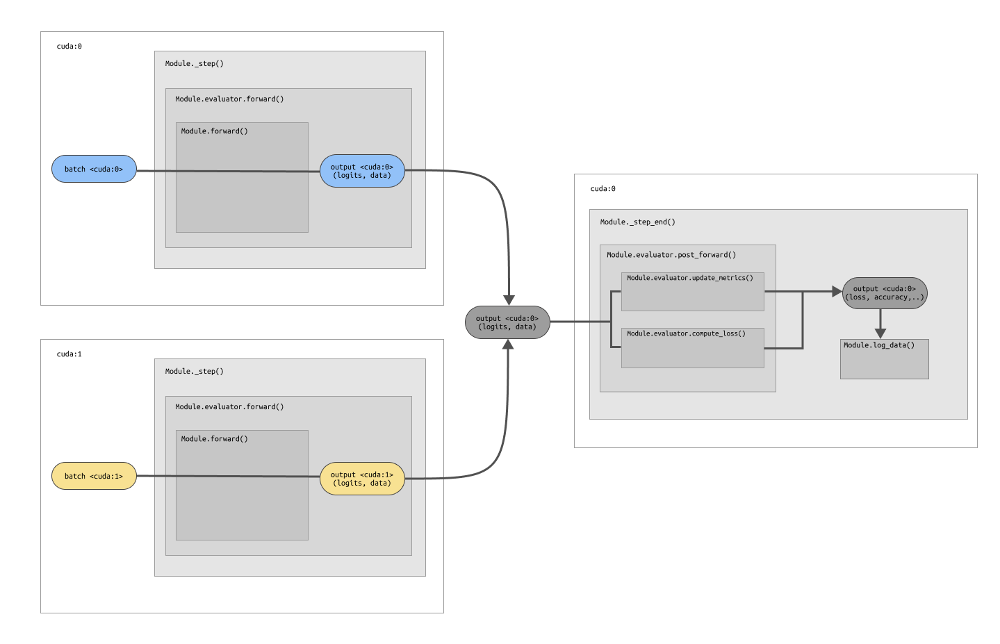
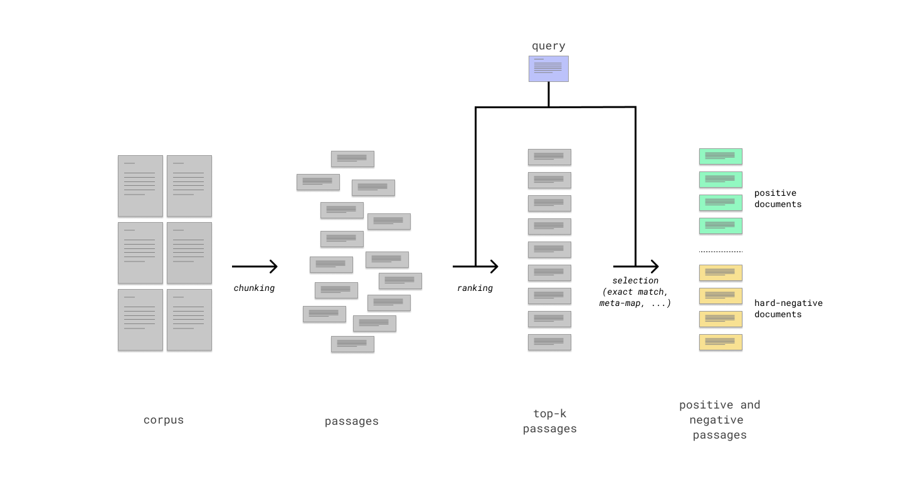

<div align="center">

 

# Medical Open Domain Question Answering


<p align="center">
<a href="https://pytorch.org/get-started/locally/"></a>
<a href="https://pytorch.org/get-started/locally/"></a>
<a href="https://pytorchlightning.ai/"></a>
<a href="https://hydra.cc/"></a>
<a href="https://black.readthedocs.io/en/stable/"></a>


[](https://github.com/vlievin/fz-openqa/actions/workflows/unit-test.yaml)
[](https://hackmd.io/HQFPXkocSMKuJvtWWVJNKg)

 </div>

## Setup

<details>
<summary>Evironment</summary>

1. Install poetry

```shell
curl -sSL https://raw.githubusercontent.com/python-poetry/poetry/master/get-poetry.py | python -
```

2. Install dependencies (within the project directory `fz-openqa/`)

```shell
poetry install

# temporary fix: run this line to force installing nmslib from source
poetry run pip install --force-reinstall --no-binary :all: nmslib
```

3. setting up git hooks

```shell
pip install pre-commit
pre-commit install
```

4. setting up ElasticSearchIndex

```shell
wget https://artifacts.elastic.co/downloads/elasticsearch/elasticsearch-7.14.1-linux-x86_64.tar.gz
tar -xzf elasticsearch-7.14.1-linux-x86_64.tar.gz
```
To run ElasticSearch navigate to the `elasticsearch-7.14.1` folder in the terminal and type `./bin/elasticsearch`.

5. Run something using the environment

```shell
poetry run python <file.py>
poetry run which python # return the path to the virtual environment
```

</details>

<details>
<summary>Running the code</summary>

`src.cli.main` can be called directly using the command `fzqa` (which can be edited in the `.toml` file):

```shell
poetry run fzqa <args>
```

Or run the python script directly:

```shell
poetry run python run.py <args>
```

</details>


<details>
<summary>Using Github</summary>

### Opening issues

Each task, bug or idea should be registered as an issue. New issues are automatically added
to `project/development/todo`. Use `- [ ] <text>` to describe each item in a task.

### Using the project tab

Use the [project page](https://github.com/vlievin/fz-openqa/projects) to keep track of progress

### Branching

Do not implement features in the `master` branch. Create a new branch for each issue. Use a pull request to merge the
branch with master and close the corresponding issue. Closed issues are automatically moved
to `project/development/done`.

</details>

<details>

<summary>Code formatting</summary>

### [Black](https://github.com/psf/black)

Black is a code formatter for python. You can run it indepedently using

```shell
black <directory>
```

### [flake8](https://flake8.pycqa.org/en/latest/)

Flake8 is a tool to ensure the code to be correctly formatted.

### Setting up git hooks using [pre-commit](http://python-poetry.org)

Git hooks allows to execute some piece of code before every commit/push/pull request/... Pre-commit hooks aim at
checking the format of the code before a commit. They can be installed using the following commands:

```shell
pip install pre-commit
pre-commit install
```

At every commit, both `black` and `flake8` will be run. If the code is not `flake8` compliant, the commit will be
rejected. Furthermore, you can run `flake8` and `black` using:

```shell
pre-commit run --all-files
```

</details>

<details>

<summary>Unit tests</summary>

Core functions should be properly tested. Unit tests can be implemented in `tests/` and executed using:

```shell
poetry run python -m unittest discover
```

</details>

## Running the code

`src.cli.main` can be called directly using the command `fzqa` (which can be edited in the `.toml` file):

```shell
poetry run fzqa <args>
```

<details>
<summary>Passing Arguments</summary>
Arguments are parse using Hydra, configurations are organized into modules (nested dictionary structure). Each attribute
can be modified through the arguments:

```shell
poetry run fzqa trainger.gpus=0 trainer.max_epochs=100 logger=wandb datamodule.lr=0.007
```

</details>

<details>
<summary>Configuring experiments</summary>

Experiment configurations define a full experimental setup in `configs/experiment/`. Run the experiment config using:

```shell
poetry run fzqa +experiment=quick_test
```

The ´environ´ configuration adjust the experiment to the environment (e.g. cache location).

Config groups selected using `@` (i.e. corpus_builder) can be overrided using command line with:
```shell
poetry run python run.py +experiment=preprocessing +environ=titan +datamodule/builder@datamodule.builder.corpus_builder=wikipedia_corpus.yaml
```


</details>

<details>
<summary>GPU cluster</summary>

When running experiments on the GPU cluster, you need to pass the flag `CUDA_VISIBLE_DEVICES` to expose GPU devices to
your script. The `/scratch` directory should be used to store large files (cache).

```shell
 CUDA_VISIBLE_DEVICES=7 poetry run fzqa +experiment=reader_only +environ=titan trainer.gpus=1
 ```

Lightning enables multi-gpus training using `torch.nn.DataParallel`. Simply configure the Lightning trainer:

```shell
CUDA_VISIBLE_DEVICES=3,4,5,6 poetry run python run.py +experiment=retriever_only +trainer.accelerator=dp trainer.gpus=4
```
 </details>

 <details>
<summary>Hyper parameter optimization</summary>

The `tune.py` script allow scheduling and running a set of experiments using `Ray[tune]`. Each experiment is described in `configs/hpo/`. Run an experiment using:

```shell
 CUDA_VISIBLE_DEVICES=0,1,2,3,4,5,6,7 poetry run python tune.py +hpo=search_retriever
 ```

</details>

 <details>
<summary>Running offline</summary>

When working without internet, datasets and models need to be cached, the following flags prevent HuggingFace from throwing an error:

```shell
HF_DATASETS_OFFLINE=1 TRANSFORMERS_OFFLINE=1  poetry run python run.py ...
 ```

</details>

## Documentation

### HfDatasetBuilder design

# todo: update this section

All modules should inherit from `HfDatasetBuilder`, which in turn inherits from `pl.LightningModule`.
Each HfDatasetBuilder features one `Module` which role is to compute the loss and the metrics.
metrics are computed using `torchmetrics` (see the section `Data flow for multiple GPUs` for more details).

<details>
<summary>Data flow within the <b>BaseModels</b> (multi-GPUs)</summary>

The main computation should be implemented in the `_step()` and `_step_end()` methods of the `HfDatasetBuilder`.
The `_step()` method runs independently on each device whereas the `_step_end()` method runs on
a single device: this is where the final aggregated loss should be implemented (see the diagram below).
The metrics must be implemented in the `_step_end` method in order to avoid errors with mutli-GPU training.



</details>

<details>
<summary><b>Module</b></summary>
The evaluator handles computing the loss and the metrics. Two methods must be implemented:

1. The `forward` method that calls the Module and compute logits or potentially a pre-loss term.
This method is called in the `HfDatasetBuilder._step()` method
2. The `post_forward` method that implements the final computation of the loss given the aggregated outputs of the
`Module.foward()` method from each device.
</details>

<details>
<summary><b>MultipleChoiceQA</b></summary>

The `MultipleChoiceQA` class implements the end-to-end open question answering pipeline.
It includes two components: a retriever and reader.
This class can be instantiated using pretrained components or the components can be trained from scratch
(at the moment both components are trained separately, but end-to-end training will be soon implemented).

The `_step` and `_step_end` both rely on the methods of the retriever and components (each with their distinct evaluators).
However, a third evaluator class (`EndToEndMultipleChoiceQaMaximumLikelihood`) is added to evaluate the end-to-end reader accuracy.

During evaluation, data from each component is managed separately (so each HfDatasetBuilder send and receive its own data between `_step` and `_step_end`).
We do so by prefixing the output data of the reader, the retriever and of the end-to-end evaluator
using the keys [`retriever/`, `reader/`, `end2end/`].
</details>

### Data Management

<details>
<summary>Datamodules and Datasets</summary>

`DataModules` are high-level classes required for `Lightning` to function optimally.
`DataModule` wraps the loading, preprocessing of the datasets.
They also include methods to construct batches of data using the `collate` method.

Each datamodule features a collection of `datasets.Datasets` objects (HuggingFace), each corresponding to a split of the dataset (train/validation/test).
Datasets are managed using `datasets.Datasets` which allows to manage the data transparently (storage, encoding, loading, caching).
</details>

<details>
<summary>Corpus</summary>

The `Corpus` object is a `DataModule` that allows to process, store and query a large collection of documents.
Each document is chunked into equal-length passages.
Each passage can be encoded into a vector representation (sparse, dense or Colbert). The whole corpus can thereafter be indexed using `faiss`.
The `faiss` index can be used to rank passages according to a given query (sparse, dense or Colbert).
Whereas HuggingFace provides methods for sparse and dense indexing. The Colbert indexing and ranking remains to be implemented.
</details>

<details>
<summary>Batch structure</summary>

A batch of data contains a question, an answer, and potentially multiple documents (positives and negatives).
Batches represent a two-level data structure with first-level keys [`question`, `answer`, `document`] and
second-level attributes [`text`, `input_ids`, `attention_mask`, `idx`, ...]. The nested-structured is flattened and keys joined
using a dot such as `document` + `input_ids` -> `document.input_ids`.


A batch of data is of the following structure.
Documents are not necessarily given as they might be sampled dynamically within the Module.

* question:
  * text: list of `batch_size` strings
  * input_ids: tensor of shape `[batch_size, L_q]`
  * attention_mask: tensor of shape `[batch_size, L_q]`
* answer:
  * text: list of `batch_size` lists of `N_a` strings
  * input_ids: tensor of shape `[batch_size, N_a, L_a]`
  * attention_mask: tensor of shape `[batch_size, N_a, L_a]`
  * target:  tensor of shape `[batch_size, ]`
* document (Optional):
  * text: list of `batch_size` lists of `N_docs` strings
  * input_ids: tensor of shape `[batch_size, N_docs, L_d]`
  * attention_mask: tensor of shape `[batch_size, N_docs, L_d]`
  * idx: tensor of shape `[batch_size, ]`
</details>


<details>
<summary>Generating the positive and negative passages</summary>

Generating the positive and hard negative passages for each question will be performed following these 3 steps:

1. a passage extractor (options: fixed length, paragraphs, ...)
2. a retriever Module (options: sparse or dense)
3. a selection strategy (options: exact match, meta-map, similarity score, ...)

Each step can be configured with different options,
so we can easily experiment with the different configurations.

The whole pipeline is pictured bellow:



</details>

## Future Improvements

<details>
<summary>Feed the answer choices to the retriever</summary>
At the moment the current Module does not use the answer choices for retrieval. Concatenate the answer choices with the query.
</details>

<details>
<summary>Late-interaction reader Module</summary>
At the moment, the reader Module requires concatenating the query with the document,
which requires processing the query and document two times (1 time for IR, one time for reading comprehension).
A late interaction Module for the reader component would allow processing each input one time with the BERT Module.
</details>

<details>
<summary>End-to-end training</summary>
The current retriever only learns to identify the golden passage (which is noisily labelled).
Sample from the retriever lives and learn from the signal given by the reader component.
</details>

## Tips and Tricks

<details>
<summary>Disk usage</summary>

Check the disk usage for each sub-directory. Useful to check the available. space on `/scratch`.
```bash
du -hs *
```
</details>

<details>
<summary>Deleting checkpoints automatically</summary>

When running the HPO, checkpoints may quickly clog the disks with hundreds of GB. You can automatically delete older runs using:
```bash
# every 5 minutes, delete all checkpoints for which the best `metric` is bellow the `metric_threshold` and that was last updated `age` hours ago
screen -S cleaner poetry run python delete_checkpoints.py --directory /scratch/valv/raytune/ --frequency 5  --metric_threshold=0.1 --age 1
```
</details>

<details>
<summary>ElastiSearch tips and tricks/summary>

```bash
# check indexes
curl 'localhost:9200/_cat/indices?v'

# delete all
curl -X DELETE 'http://localhost:9200/_all'

# start elastic search with limited heap size (16 GB)
ES_JAVA_OPTS="-Xms16g -Xmx16g" elasticsearch
```
</details>

 <details>
<summary>Export `elasticsearch`</summary>

Export `elasticsearch` so it can be called from anywhere. In `.bash_profile`add the lines:

```bash
export ES_HOME=/home/valv/libs/elasticsearch/elasticsearch-7.15.0
export PATH="$ES_HOME/bin:$PATH"
```
</details>

 <details>
<summary>Generate documentation</summary>

```bash
poetry run handsdown --exclude fz_openqa/configs -o docs
```

</details>
## Implemented papers

 1. [Dense Passage Retrieval](https://arxiv.org/abs/2004.04906?fbclid=IwAR01S2dwYNwVjdvlhpPFJ4YrIf-FKGkBU1eCM05lg4p_G732YiM3puX4N2s)
  * Dense retriever
  * Relevance Module (reader)
  * End-to-end evaluation (sample 100 passages with the retriever, score with the relevance Module, and sample the answer)
 2. [RocketQA](https://arxiv.org/pdf/2010.08191.pdf)
  * Batch-negative and hard negatives
  * Cross-batch negatives: compute the retriever loss across devices

## Credits

The package relies on:

* [Lightning](https://github.com/PyTorchLightning/pytorch-lightning) to simplify training management including
  distributed computing, logging, checkpointing, early stopping, half precision training, ...
* [Hydra](https://hydra.cc/docs/intro/) for a clean management of experiments (setting hyper-parameters, ...)
* [Weights and Biases](https://wandb.ai) for clean logging and experiment tracking
* [Poetry](https://python-poetry.org/) for stricter dependency management and easy packaging
* The original template was copied form [ashleve](https://github.com/ashleve/lightning-hydra-template)
